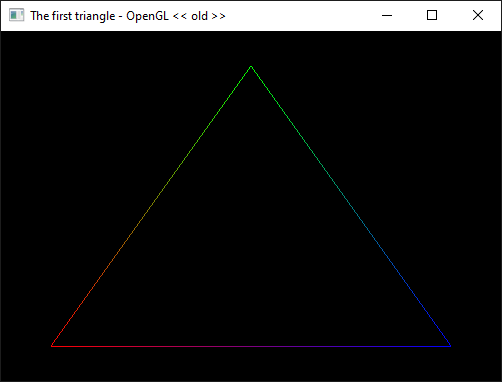
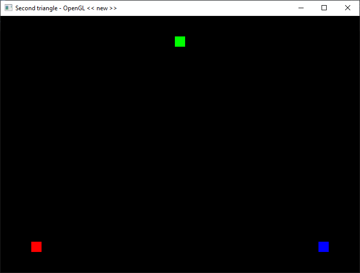
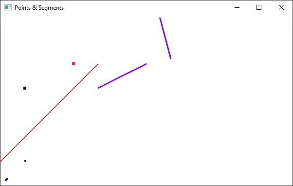
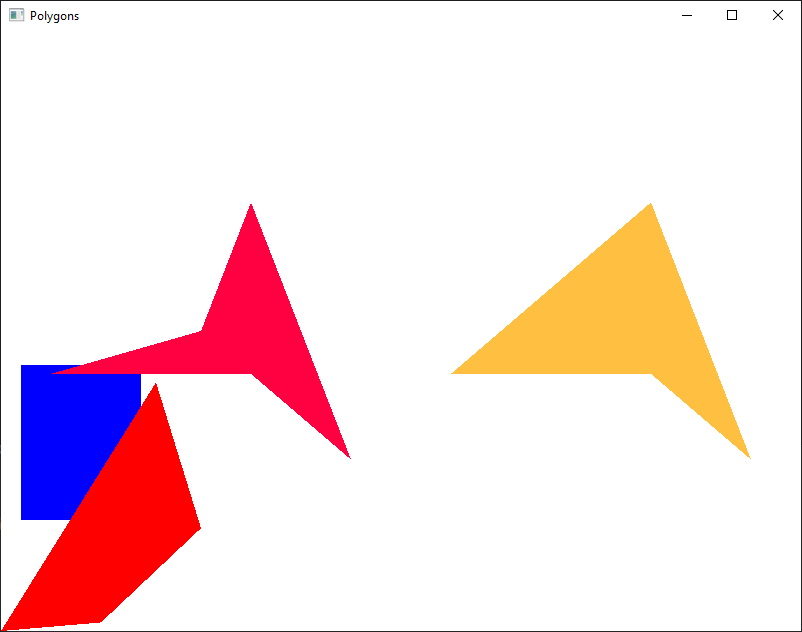

# Exercises

When running each file, make sure you add it to the Visual Studio Solution Explorer, in the `Source Files` folder. Also, make sure you are adding only one of them each time.

0. Test the OpenGL and GLSL versions by running the `00_test_version.cpp` file.

    ```
    OpenGL version supported by this platform: (4.6.0 NVIDIA 496.49)
    GLSL version supported by this platform: (4.60 NVIDIA)
    ```

1. Run the `01_01_oldOpenGL.cpp` file.

    

2. Run the `01_02_newOpenGL.cpp` file.

    

3. Run the `01_03_points_segments.cpp` file. Try modifying the colors and size of the primitives. Uncomment the lines that create a stippled line.

    

4. Run the `01_04_polygons.cpp` file. Try modifying the colors and size of the primitives. Render the primitives using the `draw2` function.

    
