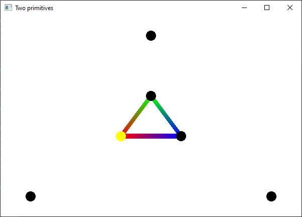
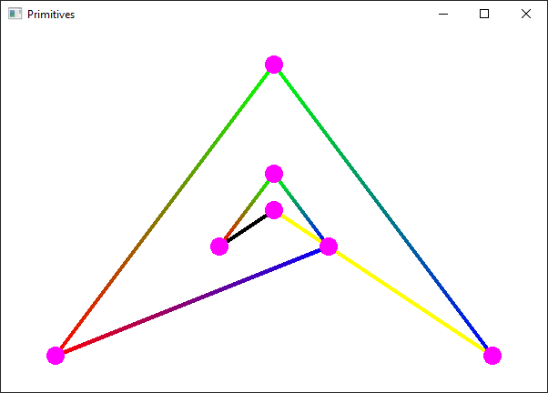

# Exercises

In this lab, you are given the header and source file for loading and external shader. 

1. Run the `02_01_two_primitives.cpp` file.

    

    Add **at least** four vertices in this source file and create a new primitive.

2. Use a `switch` statement in the shader to color differently the primitives. The statement will be added into the `02_02_Shader.frag` file.

    

3. Transfer the `01_03_points_segments.cpp` or the `01_04_polygons.cpp` source file in lab 1 from old OpenGL to new OpenGL.
