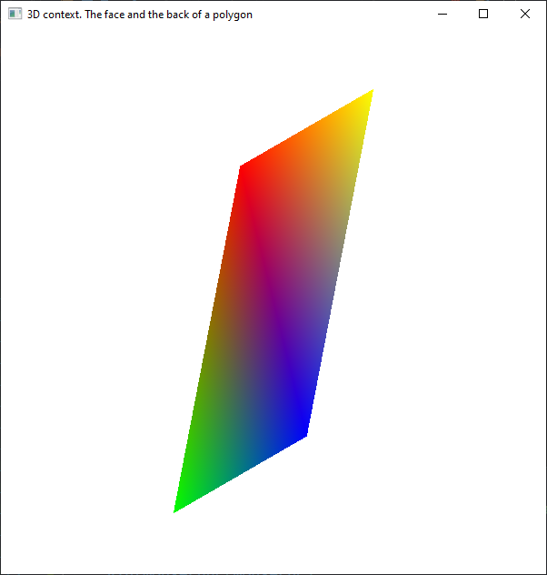
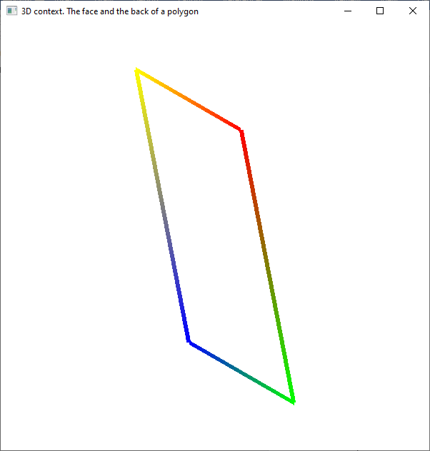
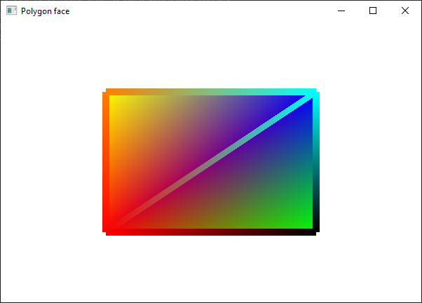

# Exercises

Don't forget to copy the `loadShaders.cpp` and `loadShaders.h` files into your project directory and load them into the Solution Explorer.

1. Run the `03_02_3dPolygons_example2.cpp` file and understand how it works. Don't forget that you need to right/left click on the screen to make the scene change.

    
    

    Now, change the behaviour when right/left clicking on the screen. For example, draw the polygon in a different way, without changing the observer's position.

2. Run the `03_02_3dPolygons_example2.cpp` file and understand how it works.

    

    Add to this drawing two new triangles, one seen from the front and one seen from the back.
