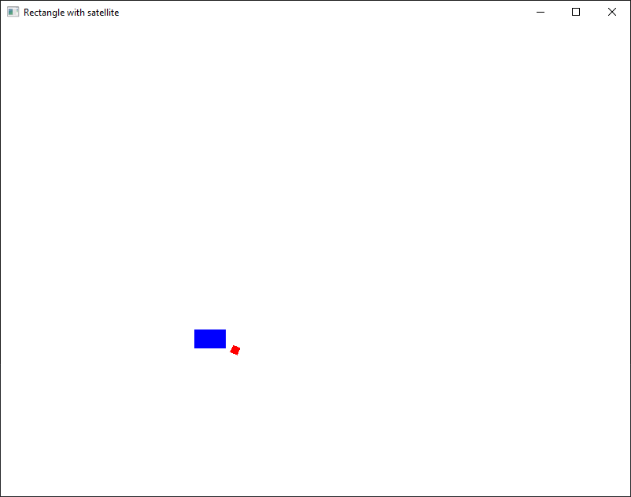
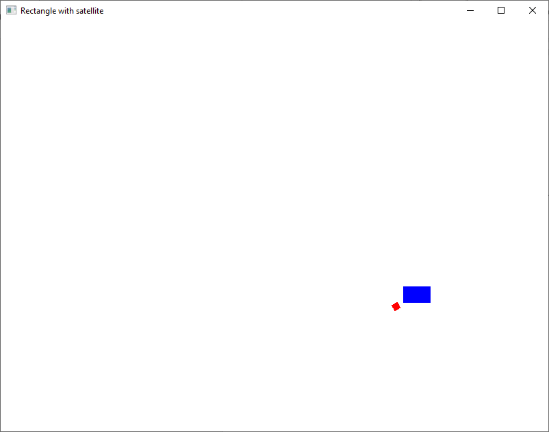
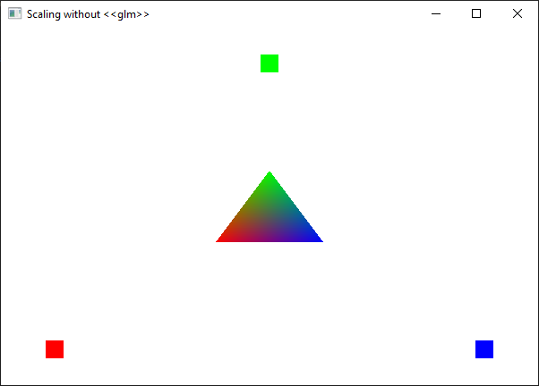
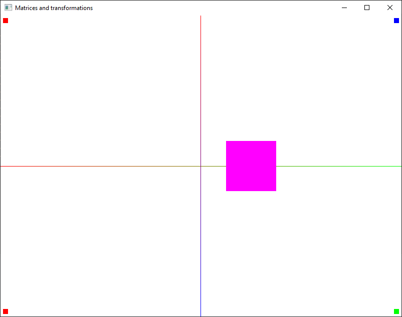
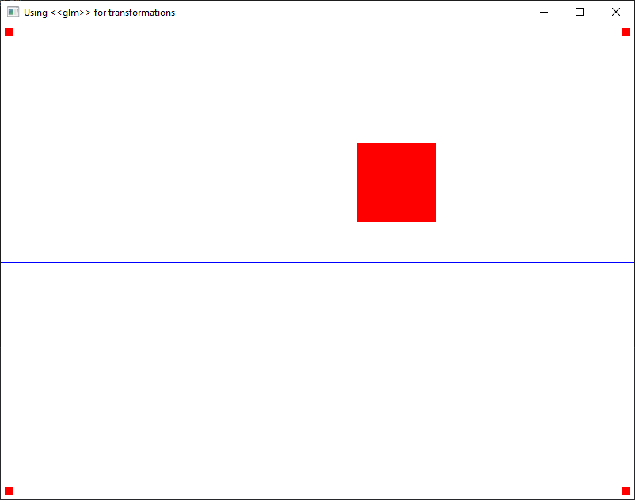
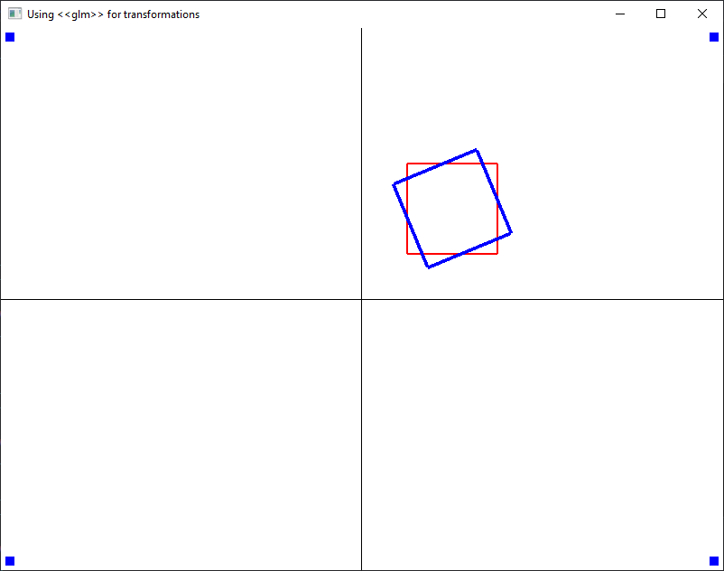
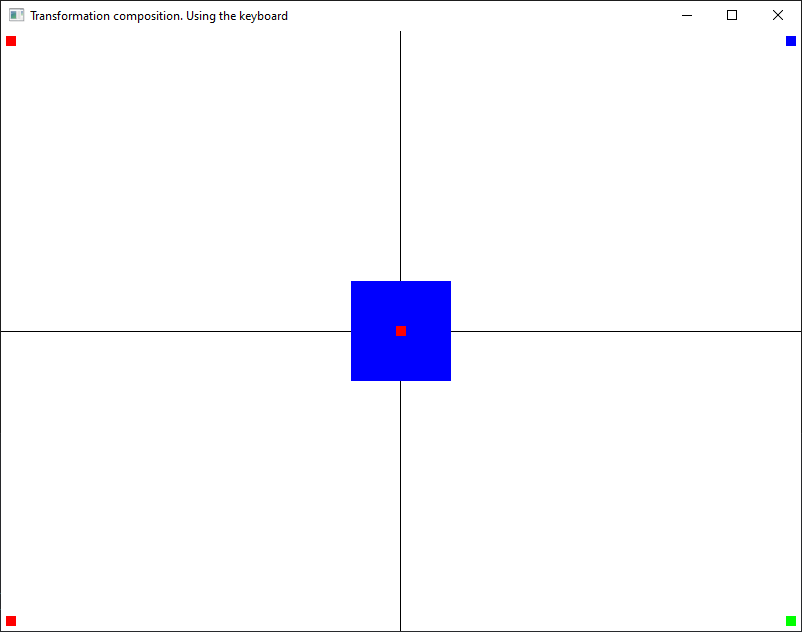
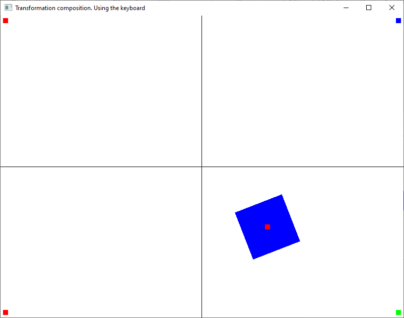

# Exercises

**Note**: Don't forget to copy `loadShaders.cpp` and `loadShaders.h` files and load them into your project.

1. Run the `04_00_animation.cpp` source code and understand how it works.

    
    

    To start and modify the animation, use right and left click.

2. Run the `04_01_resize.cpp` source code and understand how it works.

    

    Try using the other VBO created by the `CreateVBO2` function.

3. Run the `04_02_transformations.cpp` source code and understand how it works.

    

4. For this exercise, you must first install the [glm](https://glm.g-truc.net/0.9.9/index.html) library. Download and extract the zip and copy the extracted folder into the project directory.

    Run the `04_03_glm_transformations.cpp` source code and understand how it works.

    

5. Run the `04_04_glm_transformation_composition.cpp` source code and understand how it works.

    

6. Run the `04_05_keyboard_transformations.cpp` source code and understand how it works.

    
    

    Use your arrow and `l` and `r` keys to change the scene.

7. Make a new 2D scene as follows:

    a) Draw a rectangle D and 2 polygons, a convex polygon P1 and a concave polygon P2, in the [0,800]x[0,600] window rectangle.

    b) Make the background a gradient.

    c) Draw P1, P2 and also draw the shapes obtained by applying a rotation around a point P "between" the initial polygons. You choose the P coordinates.

    d) Apply a scaling on D, having any axes. Draw the initial D rectangle and also the rectangle obtained after the transformation.

    e) Make a transformation by multiplying the matrices in the shader and another transformation by multiplying the matrices in the main program.
