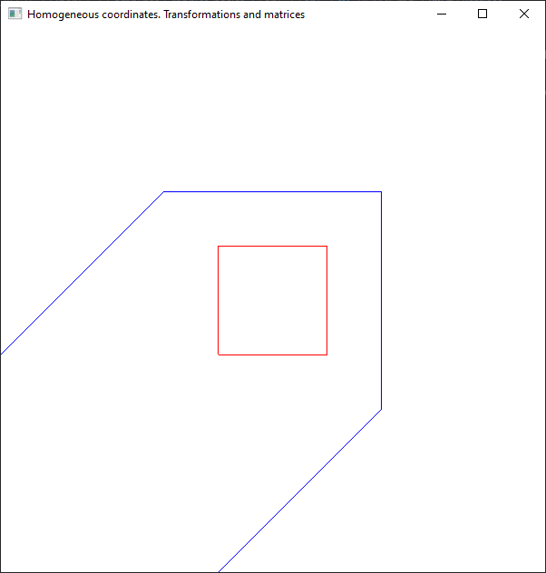
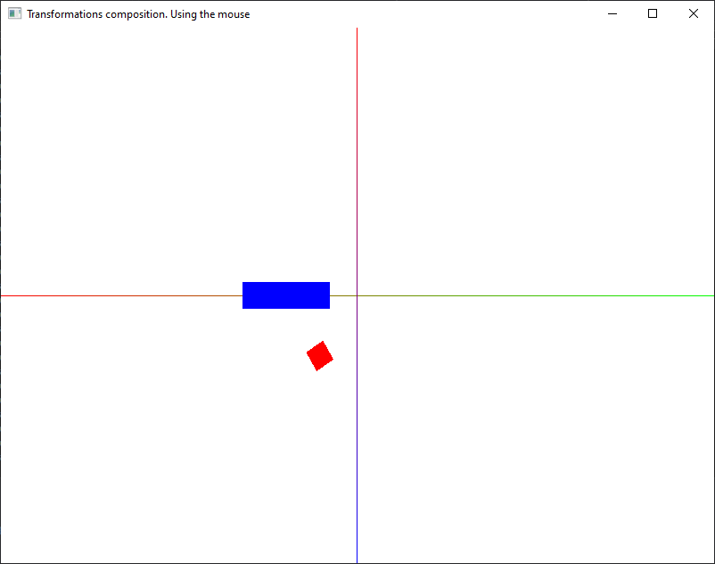
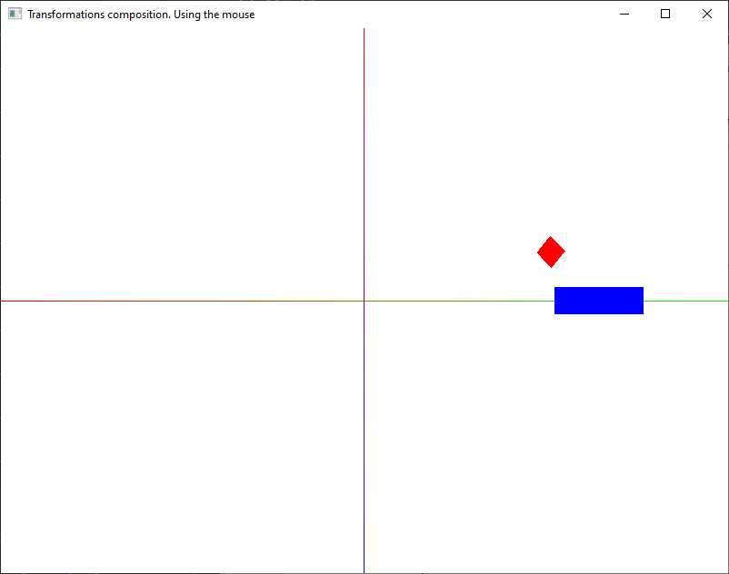
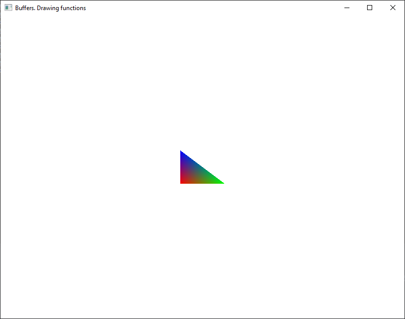
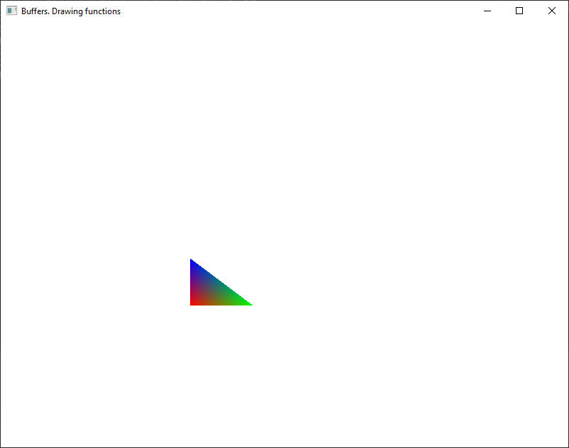
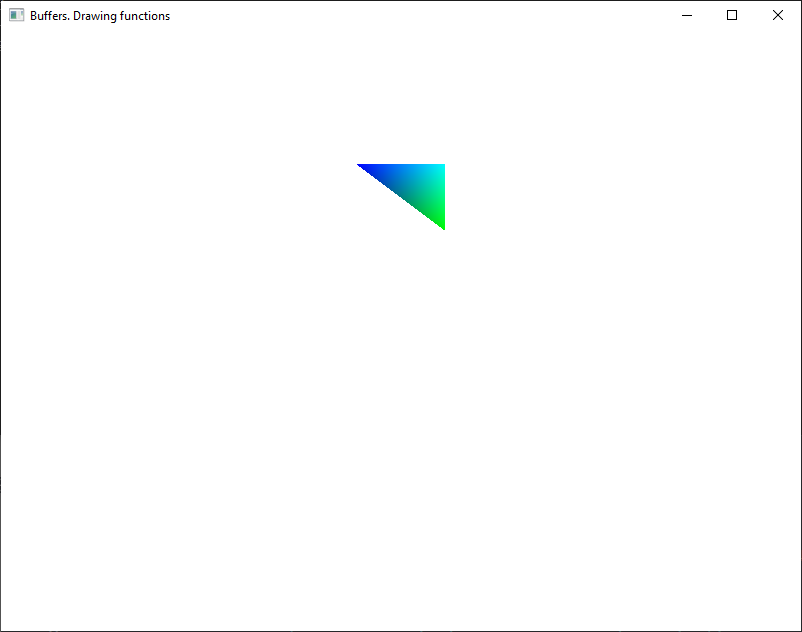
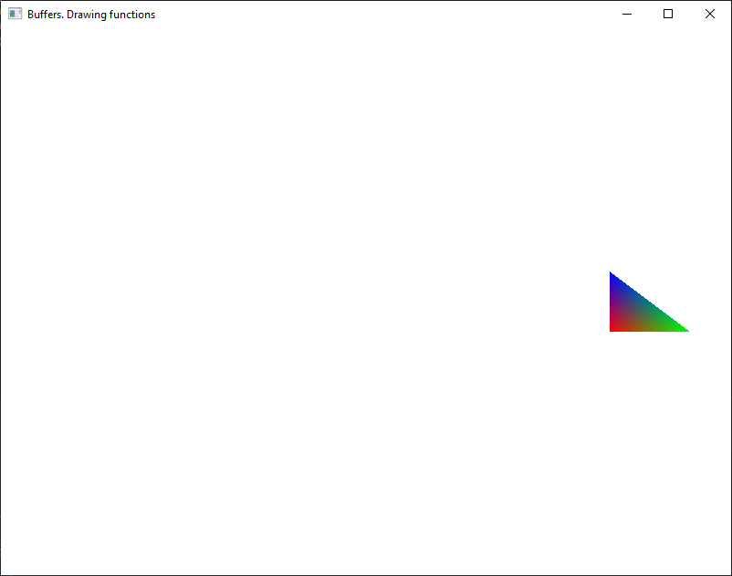
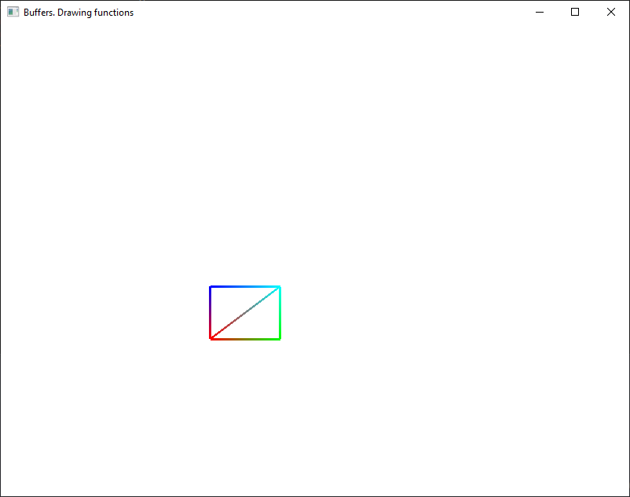

# Exercises

**Note**: Don't forget to link `freeglut.lib` and `glew32.lib` to the project and copy and load `loadShaders.cpp` and `loadShaders.h` into the Solution Explorer.

1. Run the `05_01_4coordinates.cpp` source code and understand how it works.

    

    Modify the 4th coordinate to understand its role.

2. Run the `05_02_animation.cpp` source code and understand how it works.

    
    

    Change the axis on which the rectangle is moving. Add and animate another objects.

3. Run the `05_03_drawing_functions.cpp` source code and understand how it works.

    
    
    
    

    Draw the following contour:

    
 
 