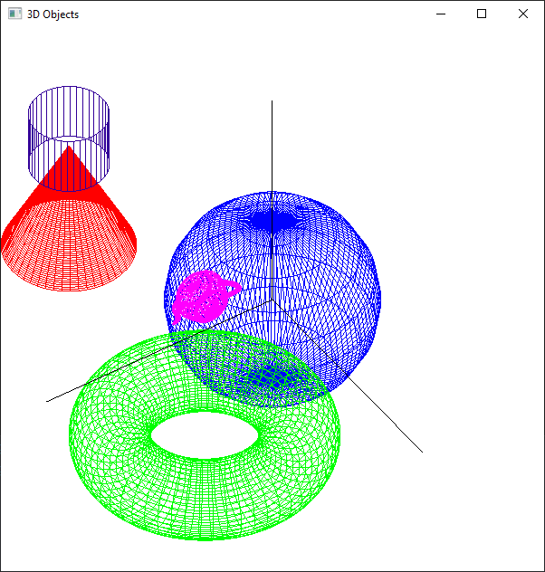
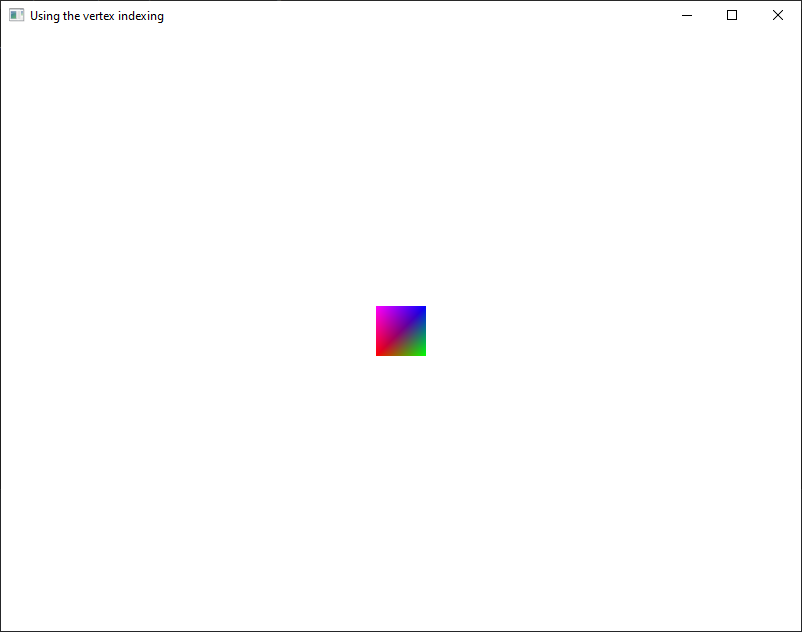
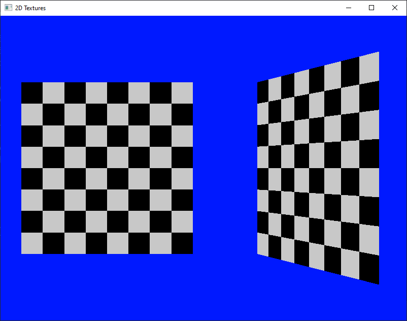
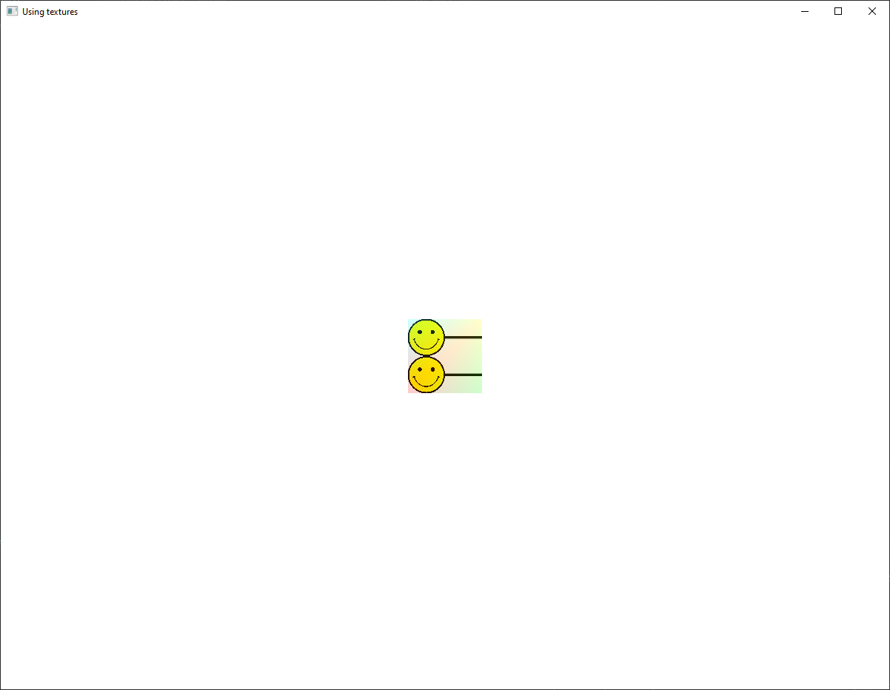
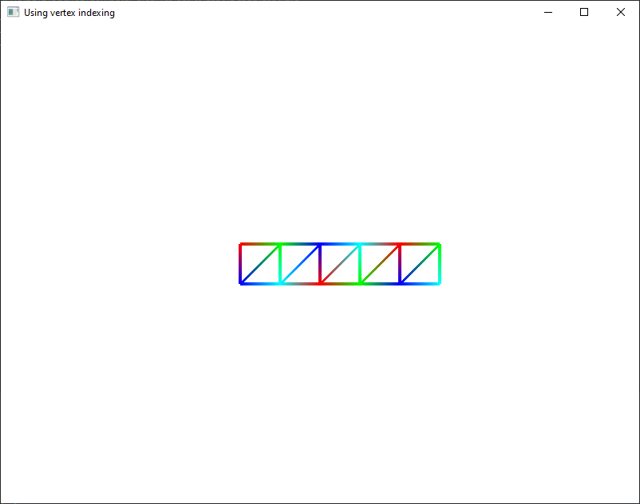
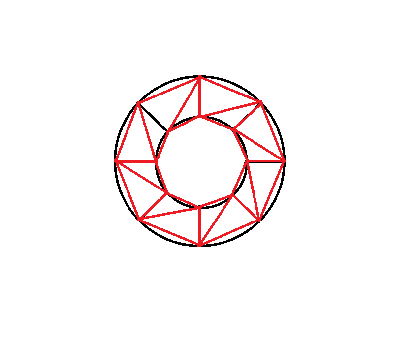

# Exercises

**Note**: Don't forget to link `freeglut.lib`, `glew32.lib` and `SOIL.lib` to the project and copy and load `loadShaders.cpp` and `loadShaders.h` into the Solution Explorer. Also, don't forget to copy the `SOIL.h` file in your project, in a new `SOIL` folder.

1.  Run the `06_01_3dObject_projections.cpp` source code and understand how it works.

    

2.  Run the `06_02_indexing.cpp` source code and understand how it works.

    

3.  Run the `06_03_2D_textures.cpp` source code and understand how it works.

    

    Try the other options in the fragment shader.

4.  Run the `06_04_Texturing.cpp` source code and understand how it works.

    

    You can change the scene using the `l`, `r`, `+` and `-` keys.

5.  Use `glDrawElements()` to draw the following scene:

    

    You can use the `06_02_indexing.cpp` source file.

    ### Extra

    Draw n points (n = 8, 10, 12, ... - you choose) on two concentric circles, with the center in the origin, then draw the following contour:

    

    Notes:

    For a circle of center `O` and radius `r`,

        x = r * cos(theta)
        y = r * sin(theta)     theta in [0, 2*PI]

    For the chosen n, `theta` will get the values `2kPI / n`, k = 0, 1, ..., n-1.

6.  In the initial `06_02_indexing.cpp` source code (that draws a single square), add a (2.0, 0.5) factor scaling and a (30, 30) vector translation .

    -   draw with green what you get by applying the scaling first, then the translation
    -   texture what you get by applying the translation first, then the scaling
