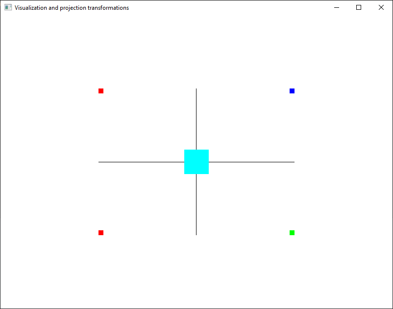
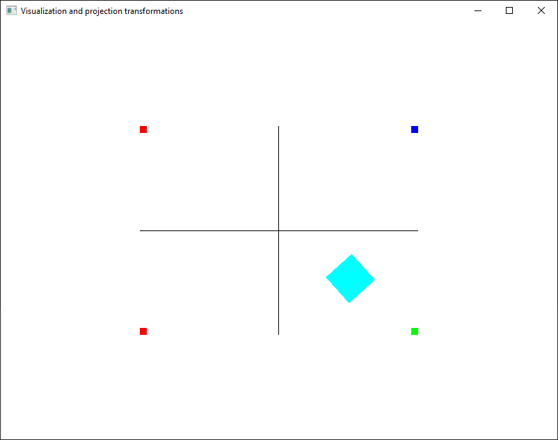

# Exercises

**Note**: Don't forget to link `freeglut.lib` and `glew32.lib` to the project and copy and load into your Solution Explorer the `loadShaders.cpp` and `loadShaders.h` files.

1. Run the `07_01_projection_testing.cpp` source code and understand how it works.

    
    
