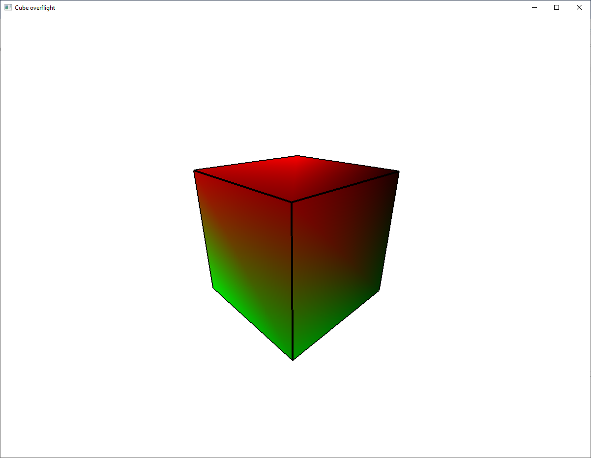

# Exercises

**Note**: Don't forget to link `freeglut.lib` and `glew32.lib` to the project and copy and load `loadShaders.cpp` and `loadShaders.h` into the Solution Explorer.

1. Run the `08_01_drawing_cube.cpp` source code and understand how it works.

    
    

    Create a new 3D object (tetrahedron / pyramid / cone, another polyhedra), explicitly indicating the vertices (use the `08_01` source code).

2. Run the `08_02_cube_overflight.cpp` source code and understand how it works.

    
    

3. Run the `08_03_instanced_rendering.cpp` source code and understand how it works.

    
    

    Use the instanced rendering to draw multiple instances of the object you created at exercise 1 (use the `08_03` source code).

4. Using the instanced rendering, arranging the objects on a 3D curve. Overflight the scene (use the `08_02` and `08_03` source codes).
