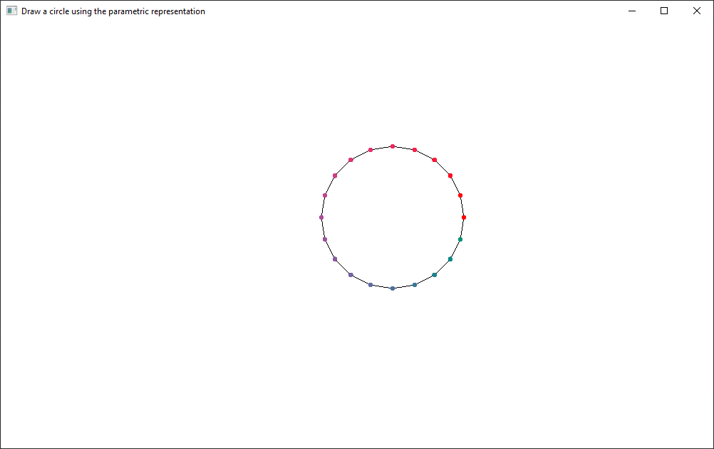
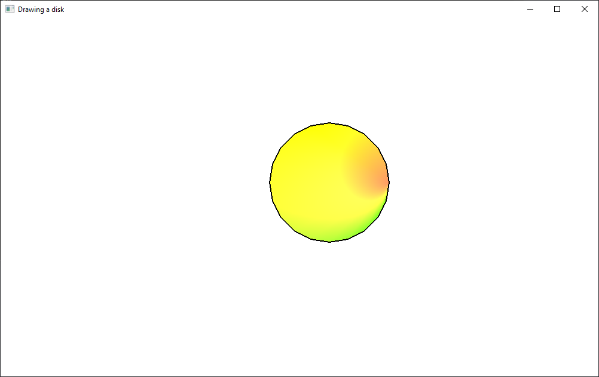
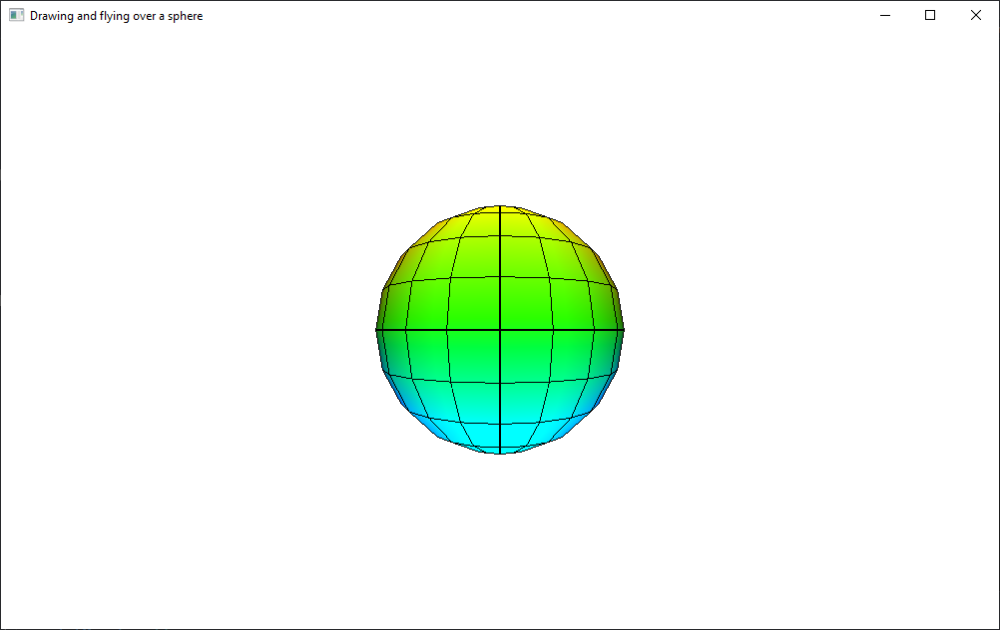
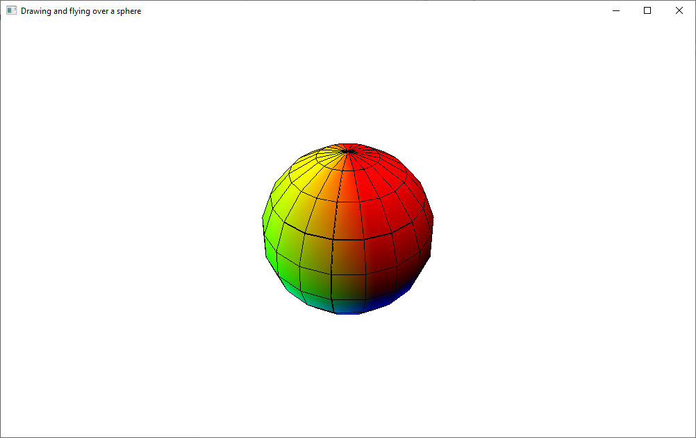

# Exercises

**Note**: Don't forget to link `freeglut.lib` and `glew32.lib` to the project and copy and load `loadShaders.cpp` and `loadShaders.h` into the Solution Explorer.

1. Run the `09_01_circle.cpp` and `09_02_disk.cpp` source codes and understand how they work.

    
    

    Draw a parameterized curve, using the circle model.

    You can find examples of curve equations [here](https://elepa.files.wordpress.com/2013/11/fifty-famous-curves.pdf) and [here](https://mathshistory.st-andrews.ac.uk/Curves/).

2. Run the `09_03_sphere.cpp` source code and understand how it works.

    
    

    Render a cylinder or a cone, using the sphere model. Use the parametric representation below, using good intervals for U and V.

    - CYLINDER, with base radius `r > 0`, fixed:

    ```
        x = r * cos(u)
        y = r * sin(u)      , u in U, v in V
        z = v
    ```

    - CONE, with base radius `r > 0`, fixed:

    ```
        x = v * cos(u)
        y = v * sin(u)      , u in V, v in
        z = v
    ```

3. Use the sphere / cylinder / cone to render a more complex 3D object (tree, snowman etc).
